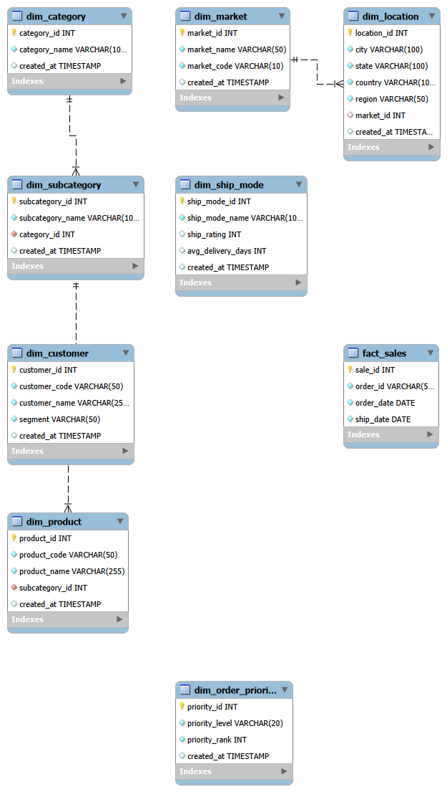

# 🏪 GlobalMart MySQL Data Warehouse

> **End-to-end MySQL Data Warehouse project** built from scratch using Star Schema design, advanced SQL analytics, and business intelligence techniques.

[](https://www.mysql.com/)
[](https://en.wikipedia.org/wiki/SQL)
[](LICENSE)

---

## 📌 Project Overview

**GlobalMart** is a fictional Fortune 500 retail company with sales data spanning **51,290 transactions (2011–2014)**. This project transforms raw transactional data into a structured **Star Schema data warehouse** optimized for analytical queries and business reporting.

### Business Problem
- No structured way to analyze years of sales performance
- Revenue flat while costs rising
- Leadership needs data-driven decisions, not gut feelings

### Solution
Built a complete MySQL data warehouse with **8 dimension tables + 1 fact table**, **50+ analytical queries**, **RFM customer segmentation**, and **automated reporting** via views, stored procedures, and triggers.

---

## 🛠️ Tech Stack

| Technology | Purpose |
|-----------|---------|
| **MySQL 8.0** | Database engine & data warehouse |
| **SQL** | Data modeling, ETL, analytics |
| **MySQL Workbench** | Schema design, query development, EER diagrams |
| **Star Schema** | Dimensional modeling for analytics |
| **Window Functions** | Advanced analytical calculations |
| **CTEs** | Recursive & non-recursive query optimization |
| **Stored Procedures** | Automated business reporting |
| **Triggers** | Data validation & audit logging |

---

## 📁 Folder Structure

```
globalmart-mysql-data-warehouse/
│
├── 📄 README.md                             
│
├── 📁 01-database-schema/                    ← Database & table creation
│   ├── 01_create_database.sql
│   └── 02_create_tables.sql
│
├── 📁 02-data-loading/                       ← Data ingestion scripts
│   └── load_all_data.sql
│
├── 📁 03-queries/                            ← 50+ analytical queries
│   ├── 01_basic_queries.sql                  (10 queries)
│   ├── 02_intermediate_queries.sql           (10 queries)
│   ├── 03_advanced_queries.sql             (10 queries)
│   ├── 04_window_functions.sql             (10 queries)
│   └── 05_executive_reports.sql            (10 reports)
│
├── 📁 04-analytics/                          ← Advanced SQL objects
│   ├── 01_views.sql                          (5 views)
│   ├── 02_stored_procedures.sql            (4 procedures)
│   ├── 03_functions.sql                    (3 UDFs)
│   ├── 04_triggers.sql                     (3 triggers)
│   └── 05_rfm_cohort_analysis.sql          (RFM + Cohort)
│
├── 📁 05-screenshots/                        ← Visual documentation
│   ├── er_diagram.png
│   ├── query_results.png
│   └── rfm_analysis.png
│
└── 📁 06-docs/                               ← Project documentation
    ├── business_requirements.md
    └── data_dictionary.md
```

---

## 🚀 How to Run This Project

### Prerequisites
- [MySQL Server 8.0+](https://dev.mysql.com/downloads/installer/)
- [MySQL Workbench](https://dev.mysql.com/downloads/workbench/) (included with MySQL installer)
- Superstore dataset (CSV) — [Download from Kaggle](https://www.kaggle.com/datasets/vivek468/superstore-dataset)

### Step 1: Install MySQL
1. Download MySQL Installer (~400MB)
2. Choose **"Server only"** or **"Full"** installation
3. Set a **root password** — write it down!
4. Keep default port **3306**

### Step 2: Create the Database
Open MySQL Workbench → Connect to Local Instance → Paste and execute:

```sql
-- From: 01-database-schema/01_create_database.sql
CREATE DATABASE IF NOT EXISTS globalmart_dw;
USE globalmart_dw;
```

### Step 3: Create All Tables
Run the schema script to create all 9 tables (8 dimensions + 1 fact):

```sql
-- From: 01-database-schema/02_create_tables.sql
-- Creates: dim_market, dim_location, dim_category, dim_subcategory,
--          dim_product, dim_customer, dim_ship_mode, dim_order_priority, fact_sales
```

### Step 4: Load Data
**Option A — MySQL Workbench Import Wizard (Easiest):**
1. Right-click any table → **"Table Data Import Wizard"**
2. Select your `superstore.csv`
3. Map columns and import

**Option B — Command Line (Faster for large files):**
```bash
mysql -u root -p globalmart_dw < your_data.sql
```

> ⚠️ **Critical:** Load dimension tables **before** the fact table, because `fact_sales` has foreign keys referencing them.

### Step 5: Run Queries & Analytics
Execute scripts from `03-queries/` and `04-analytics/` folders in order.

### Step 6: Verify Installation
```sql
-- Check row counts
SELECT 'fact_sales' AS table_name, COUNT(*) FROM fact_sales
UNION ALL
SELECT 'dim_customer', COUNT(*) FROM dim_customer
UNION ALL
SELECT 'dim_product', COUNT(*) FROM dim_product;

-- Quick business check
SELECT 
    ROUND(SUM(sales), 2) AS total_revenue,
    ROUND(SUM(profit), 2) AS total_profit,
    COUNT(DISTINCT order_id) AS total_orders
FROM fact_sales;
```

---

## 📊 Database Schema (Star Schema)



### Dimension Tables (8)
| Table | Description | Records |
|-------|-------------|---------|
| `dim_market` | Geographic markets (US, EU, APAC, etc.) | ~5 |
| `dim_location` | Cities, states, countries, regions | ~500 |
| `dim_category` | Product categories (Furniture, Office Supplies, Technology) | 3 |
| `dim_subcategory` | Product sub-categories | 17 |
| `dim_product` | Individual products | ~1,800 |
| `dim_customer` | Customer profiles with segments | ~800 |
| `dim_ship_mode` | Shipping methods & delivery ratings | 4 |
| `dim_order_priority` | Order priority levels | 4 |

### Fact Table (1)
| Table | Description | Records |
|-------|-------------|---------|
| `fact_sales` | Transactional sales data | **51,290** |

---

## 🔍 Sample Queries & Screenshots

### 1. Monthly Sales Trend
```sql
SELECT 
    DATE_FORMAT(order_date, '%Y-%m') AS month,
    ROUND(SUM(sales), 2) AS revenue,
    ROUND(SUM(profit), 2) AS profit
FROM fact_sales
GROUP BY month
ORDER BY month;
```

### 2. Top 10 Customers by Revenue
```sql
SELECT 
    c.customer_name,
    c.segment,
    ROUND(SUM(f.sales), 2) AS total_revenue,
    COUNT(DISTINCT f.order_id) AS orders
FROM fact_sales f
JOIN dim_customer c ON f.customer_id = c.customer_id
GROUP BY c.customer_id
ORDER BY total_revenue DESC
LIMIT 10;
```

### 3. RFM Customer Segmentation
```sql
-- Identifies Champions, Loyal, At-Risk, and Lost customers
-- See: 04-analytics/05_rfm_cohort_analysis.sql
```

### 4. Year-over-Year Growth
```sql
WITH yearly AS (
    SELECT YEAR(order_date) AS yr, SUM(sales) AS revenue 
    FROM fact_sales GROUP BY yr
)
SELECT 
    yr, 
    revenue,
    LAG(revenue) OVER (ORDER BY yr) AS prev_year,
    ROUND((revenue - LAG(revenue) OVER (ORDER BY yr)) / 
          LAG(revenue) OVER (ORDER BY yr) * 100, 2) AS growth_pct
FROM yearly;
```


---

## 💡 Key Insights & Findings

### 📈 Business Performance
- **Total Revenue:** $2.30M across 4 years (2011–2014)
- **Total Profit:** $286K (12.4% margin)
- **Total Orders:** 9,994 unique orders
- **Average Order Value:** $230

### 🎯 RFM Segmentation Results
| Segment | Count | Action |
|---------|-------|--------|
| **Champions** | 128 | Reward them, early adopters for new products |
| **Loyal Customers** | 156 | Upsell higher value products |
| **At Risk** | 98 | Send personalized reactivation campaigns |
| **Lost** | 87 | Not worth the effort — ignore |

### 📦 Product Insights
- **Technology** category has highest profit margin (~15%)
- **Furniture** category has lowest margin (~2%) — consider discontinuing loss-making SKUs
- Top 20 products generate 35% of total revenue

### 🌍 Regional Analysis
- **West region** outperforms all others in revenue and profit
- **Central region** has highest discount rates — hurting profitability
- **South region** shows growth potential but needs inventory optimization

### 📅 Seasonal Trends
- **Q4 (Oct–Dec)** generates 32% of annual revenue
- **November** is the peak month — plan inventory accordingly
- **January–February** are slowest months — ideal for clearance sales

---

## 🧠 SQL Skills Demonstrated

| Skill | Implementation |
|-------|----------------|
| **Joins** | INNER, LEFT, RIGHT, CROSS, SELF joins across 9 tables |
| **CTEs** | Recursive and non-recursive for complex calculations |
| **Window Functions** | ROW_NUMBER, RANK, DENSE_RANK, LAG, LEAD, NTILE |
| **Subqueries** | Correlated and non-correlated nested queries |
| **Stored Procedures** | Parameterized reports for sales, customers, products |
| **User Functions** | Reusable profit margin, customer tier, shipping rating |
| **Triggers** | Data validation, audit logging for compliance |
| **Views** | Pre-built analytical views for executive dashboards |
| **Indexing** | B-tree, composite, covering, full-text indexes |
| **Data Quality** | CHECK constraints, validation triggers, audit queries |

---

## 📂 Data Dictionary

See [`06-docs/data_dictionary.md`](06-docs/data_dictionary.md) for complete column definitions, data types, and relationships.

---

## 📋 Business Requirements

See [`06-docs/business_requirements.md`](06-docs/business_requirements.md) for:
- Problem statement & success criteria
- Key business questions answered
- Data sources & scope
- Success metrics

---

## 🤝 How to Contribute

1. Fork this repository
2. Create a feature branch (`git checkout -b feature/amazing-feature`)
3. Commit your changes (`git commit -m 'Add amazing feature'`)
4. Push to the branch (`git push origin feature/amazing-feature`)
5. Open a Pull Request

---

## 📄 License

This project is licensed under the MIT License — feel free to use it for your portfolio, learning, or teaching.

---

## 👤 Contact

| Platform | Link |
|----------|------|
| **LinkedIn** | [Your LinkedIn Profile](www.linkedin.com/in/syed-mahammad-saleem-368301264) |
| **GitHub** | [Your GitHub Profile](https://github.com/syedmahammadsaleem-SS) |
| **Email** | syedmahammadsaleem@gmail.com |


> 💬 **Open to Data Analyst / BI Developer roles.** Let's connect!

---

## ⭐ Show Your Support

If this project helped you learn or build your portfolio, please ⭐ star this repository!

```
⭐ Star this repo → Fork it → Customize with your data → Add to your resume
```

---

<p align="center">
  <b>Built with ❤️ for aspiring Data Analysts & SQL Developers</b>
</p>
